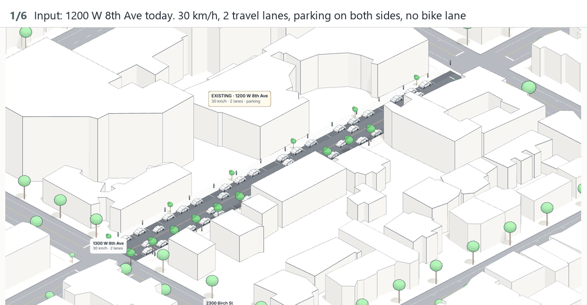
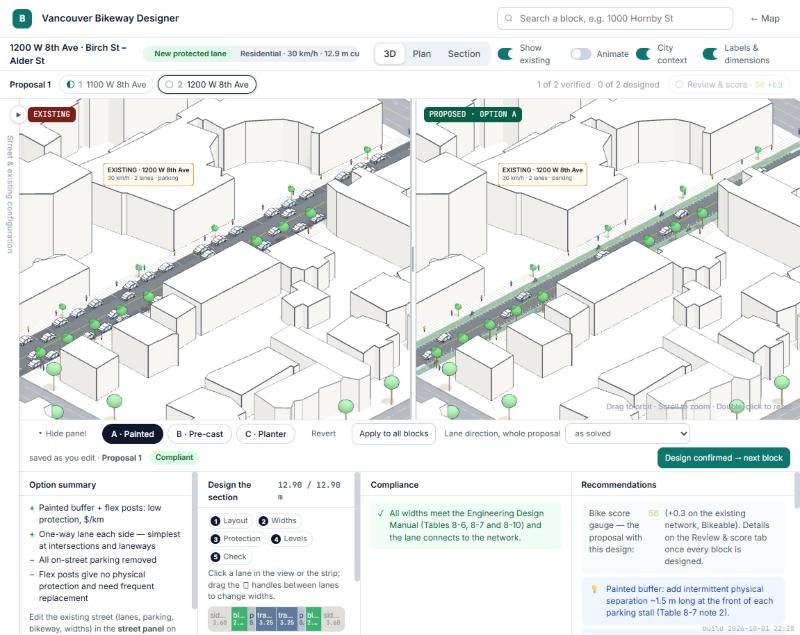

# Vancouver Bikeway Designer

**Open the tool: https://fl-79.github.io/540-A1-Bikeway-Designer/**

ARCH 540 · Designing the Design · Assignment 1

---

## 1. Purpose

Bikeway Designer lets community members and planners test bike lane proposals against Vancouver's existing bikeway network. Users can upgrade existing routes to extend the All Ages and Abilities (AAA) network, design a new protected lane and check it against the City's Engineering Design Manual, or see where bike infrastructure sits in relation to their site. The aim is a connected network that helps Vancouver reach its *Climate Emergency Action Plan* goals and support the *Vision Zero Safe Mobility Plan*. These targets are two-thirds of all trips made on foot, by bike or by transit by 2030, and zero traffic fatalities and serious injuries before 2050, respectively.

---

## 2. How to use it

The tool is a single web page. It runs in the browser and needs no installation or account.

### Open it

- **Online:** open the link at the top of this page. Chrome, Edge or Firefox on a laptop or desktop works best.
- **On your own computer:** download or clone this repository, then run the command below from its folder. Python 3 is the only requirement. Then open http://127.0.0.1:8766/index.html.

  ```
  python scripts/serve.py
  ```

An internet connection is needed either way: the 3D library, the fonts and Google Street View load from the web. All the city data is built into the page.

### Design a bike lane

1. **Pick blocks on the map.** The map shows Vancouver's existing bikeway network. With **Build** selected, click a street block to add it to a proposal, and click it again to remove it. **Route fill** adds every block between a start block and an end block that you click. A proposal holds up to 12 blocks.
2. **Continue.** The proposal card on the right shows the bike score and a checklist. Press **Continue →** to open the design screen. Each block of the proposal has its own tab along the top.
3. **Verify the existing street.** The panel on the left shows Google Street View of the block and its recorded configuration: curb-to-curb width, travel lanes, parking, existing bike facility and bus or truck route. Correct anything that differs from the photo, then press **Existing street is correct → Design**.
4. **Choose and adjust a design.** The tool proposes up to three compliant options (A, B, C), each with a different kind of separation. Switch between **3D**, **Plan** and **Section**. In Plan or Section, drag the handles between lanes, or click a dimension and type a width. The **Compliance** panel checks every width against the Engineering Design Manual as you edit. **Recommendations** list what to improve and show the bike score. Designs save automatically. Press **Design confirmed → next block** to move on.
5. **Review and score.** When every block is verified and designed, the **Review & score** tab becomes available. It draws the whole proposal in plan and 3D, with the bike score before and after. **Export summary ↓** downloads a report with the drawings and the numbers.
6. **Finish.** **Done · back to map** completes the proposal. The next block you click on the map starts a new proposal.

Work is kept in the browser between visits. The save icon in the project panel downloads the project as a file, and the folder icon opens it again.

---

## 3. Source

**City of Vancouver, *Engineering Design Manual*, Version 1.1, April 2026**, Chapter 8, which covers bikeway design:

| Used for | Clause |
|---|---|
| Bike lane widths (absolute minimum, minimum, preferred) | Table 8-6, Bicycle Facility Widths |
| Buffer widths by separation type | Table 8-7, Buffer Widths |
| Travel lane widths, including the wider lanes for bus and truck routes | Table 8-10, Lane Width by Facility Type |
| Painted lanes and shared lanes are not All Ages and Abilities (AAA) facilities | Section 8.5.3.4 Painted Bicycle Lanes and Painted Buffered Bicycle Lanes; Section 8.5.3.5 Shared Use Lanes |
| Marked crosswalks, at signalised intersections only | Section 8.8.1.7 Standard Marked Crosswalks |
| Bicycle and vehicle stop bars | Section 8.9.1.8 Stop Bars |
| Dividing line on two-way bike lanes | Section 8.9.1.11 Directional Dividing Lines |
| Green paint and stencils in the bicycle crossing | Section 8.9.1.12 Bicycle Green Surface Treatment; Table 8-18 Green Treatment Uses; Table 8-19 Stencils |

**TransLink, *Rapid Implementation Design Guide for Bikeways in Metro Vancouver*, November 2022:** Figure 32 and Tables 3 to 9, for the protection level and durability of each separation material (flex posts, planters, pre-cast and extruded curbs, raised lanes, barriers).

**City of Vancouver, *Transportation Design Guidelines: All Ages and Abilities Cycling Routes*, Version 1.1, March 2017:** the definition of an AAA route that the compliance check and the bike score work towards.

**Data:** City of Vancouver Open Data (street centrelines, right-of-way widths, bikeways, intersections, traffic signals, truck routes, one-way streets, public trees, building footprints 2009 with LiDAR heights and 2015, parks, shoreline, city boundary, contours, bike racks). OpenStreetMap contributors, under the Open Database Licence (lane counts, one-way direction, speed limits, paths, bridges, building heights). TransLink GTFS (bus routes and stops).

---

## 4. Example

**Input:** 1200 W 8th Ave, between Birch St and Alder St. The City's records give a 20.1 m right-of-way with a 12.9 m curb-to-curb width, two travel lanes, parking on both sides and no bike facility.

**Result:** option A, a one-way protected bike lane on each side. Each side has a 2.4 m bike lane and a 0.8 m painted buffer with flex posts, between two 3.25 m travel lanes and the existing 3.6 m sidewalks. The design removes on-street parking to make the room. The compliance check confirms that every width meets the Engineering Design Manual (Tables 8-6, 8-7 and 8-10) and that the lane connects to the network. The bike score gauge shows a gain of +0.3 on the existing network.

The demo below steps through the existing street, the three options the tool generates, and option A in plan and section.



The design screen, with the existing street on the left, the proposal on the right, and the compliance check and recommendations below:



---

## 5. Limits

- **Street widths and lane counts are partly inferred.** The City publishes right-of-way widths but not curb-to-curb widths, lane counts or curb lines. The tool estimates them, takes lane counts and one-way direction from OpenStreetMap where tagged, and asks you to check them against Street View before designing.
- **The options are chosen from the speed limit alone unless you enter a traffic volume.** The guidelines set the type of separation by motor-vehicle speed and daily volume together, but no public data gives daily volumes per block. Without a volume, the posted speed decides:

  | Posted speed | Options offered |
  |---|---|
  | 30 km/h or less | flex posts, pre-cast concrete curb, planters |
  | 31 to 59 km/h | pre-cast curb, extruded concrete curb, concrete barrier |
  | 60 km/h or more | extruded curb, concrete barrier, pre-cast curb |

  If you enter a daily volume in the existing-street panel, the tool applies the volume thresholds as well. From 4,000 vehicles a day a 30 km/h street no longer gets the low-speed set, flex posts are flagged above 6,000, and from 10,000 the street gets the highest-protection set.
- **Accessibility details are not designed.** The tool sets lane and sidewalk widths but does not lay out curb ramps, tactile walking surface indicators where people cross the bike lane, accessible bus stops (boarding islands across the bike lane), accessible parking and loading, or sidewalk cross slopes. A permanent design must be checked for these against the standards the manual refers to, including CSA Group's *Accessible Design for the Built Environment* and TransLink's *Universally Accessible Bus Stop Design Guidelines*.
- **Turn lanes, medians and traffic islands are not modelled.** The City's data has no lane-level geometry, so every block is drawn with one cross-section from end to end. Existing left- and right-turn lanes, medians, traffic islands, channelised right turns and corner bulges are not shown, and a proposal does not account for them. Where a street has them, the space at the intersection is usually tighter than the tool shows, and a design must decide whether to keep, move or remove them.
- **Intersections are generalised.** Corner radii are assumed at 5 m, and the cross street's lane layout is generic.
- **Bridges and ramps are context only.** You cannot design on the Burrard, Granville or Cambie bridges or their ramps.
- **The bike score is indicative.** It compares proposals with each other and is not a ridership forecast.
- **A person must check the result.** The tool checks widths and markings against the manual. It does not replace an engineer's review of sightlines, drainage, transit stops, loading zones or signal timing.

Design notes, data processing and every change made during development are in [docs/technical-notes.md](docs/technical-notes.md).
